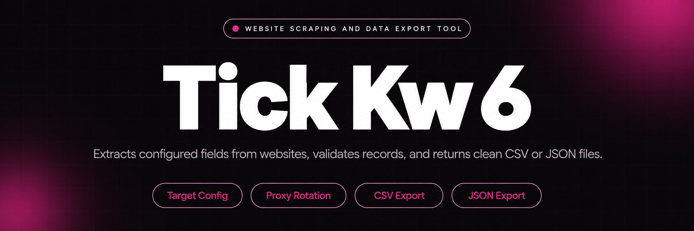
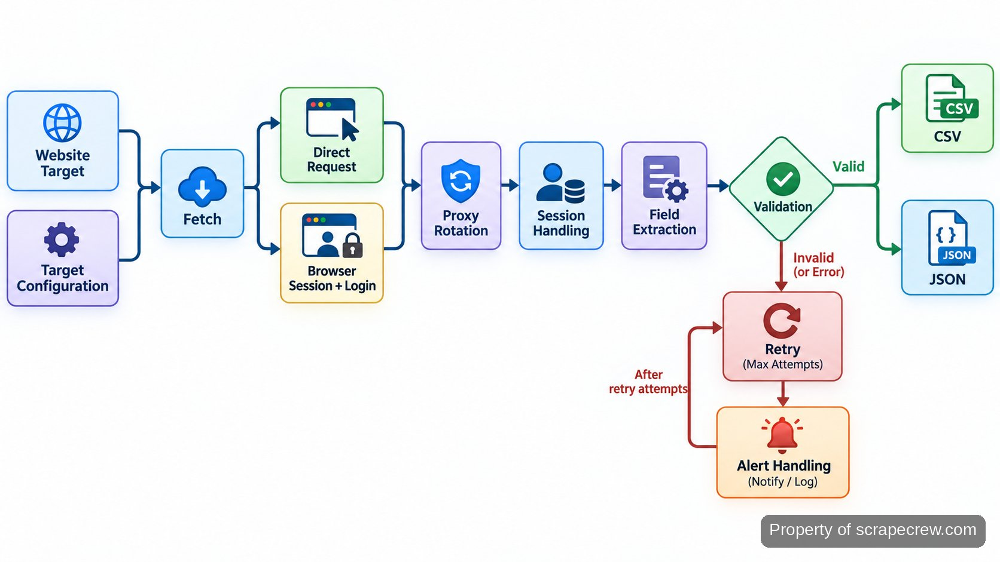

<p align="center">
  <a href="https://www.scrapecrew.com" target="_blank" rel="nofollow">
    
  </a>
</p>

## tick kw 6

**tick kw 6** is the scraper repository I use when a website has to become structured data instead of a pile of copied pages. It takes target settings, opens pages directly or through browser automation when rendering or login is required, rotates proxies when configured, extracts the fields defined for that target, validates each record, retries failures, and writes clean exports. The useful boundary is simple: this is not a general browser or a point-and-click crawler. It is a repeatable extraction project for known targets where the output needs to be CSV or JSON now, with the same pipeline able to feed a sheet or warehouse when the run is wired that way.

<a href="https://www.scrapecrew.com" target="_blank" rel="nofollow">
  
</a>

<p align="center">
  <a href="https://t.me/Bitbash333" target="_blank" rel="nofollow">
    
  </a>&nbsp;
  <a href="https://wa.me/923249868488?text=Hi%2C%20I%27m%20interested." target="_blank" rel="nofollow">
    
  </a>&nbsp;
  <a href="mailto:hello@scrapecrew.com" target="_blank" rel="nofollow">
    
  </a>&nbsp;
  <a href="https://www.scrapecrew.com" target="_blank" rel="nofollow">
    
  </a>
</p>

## What the run actually does

A run starts from a target configuration rather than from ad hoc scraping logic typed at the prompt. The configuration holds the start URL, the fields to collect, and the access settings needed for that target. The runner fetches the page, follows the browser path when JavaScript rendering or an authenticated session is necessary, and passes the returned page into the extractor. Parsed records are checked before export so a selector that suddenly returns blanks does not quietly become a “successful” dataset. HTTP failures are handled as run failures rather than valid rows; the meaning of common response codes is defined in <a href="https://www.rfc-editor.org/rfc/rfc9110" target="_blank" rel="nofollow">HTTP Semantics</a>. That distinction matters most on repeat runs, because a blocked request and a genuinely empty page look similar if validation is skipped.

## Core Features

| Feature | Description |
| --- | --- |
| Structured field extraction | Manual cleanup is the expensive part of copied web data. The extractor maps the target fields into records instead of returning half-parsed page markup. |
| JavaScript and login handling | Pages that do not reveal useful data in the first response can be opened through browser automation with session handling before extraction starts. |
| Proxy rotation | Repeated requests can be blocked after repeated requests. Configured proxy rotation changes the network route used by the run rather than forcing one failing route repeatedly. |
| Validation before export | Silent blanks are harder to spot than hard errors. Required fields are checked before a record is accepted, so broken selectors surface as failures. |
| Retries and alerts | Transient request failures should not require babysitting. Failed work is retried, while persistent breakage is raised for attention instead of being hidden in the output. |
| CSV and JSON writers | Downstream work should not begin with format conversion. The run can write tabular CSV or structured JSON; the relevant interchange formats are described in <a href="https://www.rfc-editor.org/rfc/rfc4180" target="_blank" rel="nofollow">RFC 4180</a> and <a href="https://www.rfc-editor.org/rfc/rfc8259" target="_blank" rel="nofollow">RFC 8259</a>. |

## Pipeline from target to export

The pipeline is intentionally linear because each stage has one job and one obvious failure mode. A target enters through configuration. The fetch stage either makes a normal request or opens a browser session. Access state and proxy rotation sit in front of parsing, not after it, so the extractor only sees the page that was actually returned. Parsing turns the returned <a href="https://html.spec.whatwg.org/" target="_blank" rel="nofollow">HTML</a> into named fields. Validation then decides whether the record is acceptable. Only validated rows reach the export writers. When a request or validation check keeps failing after its retry path, the run reports the problem instead of mixing partial rows into the same file. Before adding a new target, I also review its robots.txt rules and terms; robots.txt is standardized in <a href="https://www.rfc-editor.org/rfc/rfc9309" target="_blank" rel="nofollow">RFC 9309</a>, but permission and site terms still need human judgment.



## Inputs, configuration, and outputs

The repository keeps target-specific details outside the extraction code. A target file defines the page to open and the fields expected from it; environment values hold machine-specific settings such as proxy credentials. That separation makes a selector change local to one target instead of a reason to rewrite the runner. A typical product-list target might define `name`, `availability`, `rating`, and `url` as required fields. If `availability` disappears after the site changed, validation fails the affected records rather than producing an apparently complete export with an empty column. CSV is useful when the next stop is a spreadsheet or CRM-style table. JSON keeps nested values intact for code or warehouse loading. The JSON data model is defined independently of any scraper implementation in <a href="https://www.rfc-editor.org/rfc/rfc8259" target="_blank" rel="nofollow">RFC 8259</a>.

```yaml
name: catalog
start_url: https://example.invalid/catalog
required_fields:
  - name
  - availability
  - url
fields:
  name: product_name
  availability: stock_status
  rating: review_rating
  url: canonical_url
render: browser
session: login
exports:
  - csv
  - json
```

<a href="https://tally.so/r/BzWjZQ?platform=GitHub&amp;format=Product+repo&amp;brand=ScrapeCrew&amp;niche=scraping&amp;page=Tick+Kw+6+on+Local+Machines&amp;date=2026-09-26" target="_blank" rel="nofollow">
  
</a>

## Repository layout

The layout separates reusable pipeline code from target rules and generated data. `src` contains the runner, browser and request access paths, extraction, validation, retry handling, and exporters. `config/targets` holds one target definition per site or workflow. `data/out` is write-only output and should not become a source of truth for selector logic. `tests` covers parsing and validation against saved fixtures so a target change can be checked before a scheduled run is trusted again. The `.env.example` file documents machine-local settings without committing real credentials. Keeping credentials out of tracked files also avoids turning a convenient repository into a secret-distribution mechanism.

```text
scraper-project/
├── src/
│   ├── cli.py
│   ├── runner.py
│   ├── access/
│   │   ├── request.py
│   │   ├── browser.py
│   │   ├── session.py
│   │   └── proxy.py
│   ├── extract.py
│   ├── validate.py
│   ├── retry.py
│   └── exporters.py
├── config/
│   └── targets/
│       └── catalog.yml
├── data/
│   └── out/
├── tests/
│   ├── fixtures/
│   ├── test_extract.py
│   └── test_validate.py
├── requirements.txt
├── .env.example
└── README.md
```

## Runtime stack and failure handling

This project runs as a <a href="https://docs.python.org/3/" target="_blank" rel="nofollow">Python command-line application</a>. Python is used for the runner, configuration loading, parsing, validation, and export code; browser automation is invoked only for targets that need rendered JavaScript or login state. The direct-request path stays available for simpler pages so every target does not pay the overhead of a browser session. The access layer also owns proxy rotation and session reuse, which keeps those concerns out of field extraction. On the failure side, the important distinction is transient versus structural. A temporary network error is eligible for retry. Repeated blocking, a missing required field, or a selector that no longer matches is structural and should stop clean output. The run log records failures and the validation result, making “the site changed” a visible condition rather than a quiet data-quality problem.

## Setup and local commands

The local setup is conventional: create an isolated Python environment, install the repository requirements, copy the example environment file, and add only the credentials this target needs. No service account or remote dashboard is required for the basic local path. The run command points at one target file and one output directory, which keeps testing a changed selector separate from any scheduled job. I normally run the validation tests before a target is put back on an hourly or daily schedule. The repository does not claim one universal runtime because page weight, login steps, blocking, and retry activity differ by target; use the logged start and finish times from the actual target instead of treating a synthetic benchmark as representative.

```bash
python -m venv .venv
. .venv/bin/activate
python -m pip install -r requirements.txt
cp .env.example .env
python -m pytest
python -m src.cli run --target config/targets/catalog.yml --out data/out
```

## How to Extract Website Data Using tick kw 6

- **STEP 1 - Download & Set Up the Project**  
Download, set up, and install **tick kw 6** to get the project running from this repository; create the local environment, install requirements, and copy the example environment file.
- **STEP 2 - Open the Target Configuration**  
Edit the target YAML file and confirm the start URL, required fields, rendering mode, session setting, and export formats for the site.
- **STEP 3 - Validate the Target Rules**  
Run the test suite, then check the target fields against a saved or current page so missing selectors fail before scheduled extraction starts.
- **STEP 4 - Run and Read the Export**  
Execute `python -m src.cli run`, then use the validated CSV or JSON files written under `data/out`; inspect the log if retries or validation fail.

## Use Cases

- Build a repeatable product, listing, availability, or review export when copying pages by hand would leave inconsistent columns and missing fields.
- Run a target that needs login state or JavaScript rendering, while keeping session handling and browser work outside the extraction rules.
- Refresh a lead or research dataset on an hourly or daily schedule, with validation catching blank required fields before the file moves downstream.
- Keep an operations feed usable after a site change by isolating target rules, testing the fix, and rerunning the same export path instead of rewriting the whole scraper.

The repository is a good fit when the target and required fields are known, clean exports matter more than raw page capture, and somebody is willing to own the target rules when the site changes. It is less suitable for open-ended discovery where the schema is unknown before the crawl. The practical test is whether you can describe the expected record before the run starts. If you can, validation has something concrete to enforce, retries have a defined boundary, and the output can be checked before it reaches a sheet, CRM, or warehouse. That is the part worth keeping: not a promise that websites stay stable, but a run path that makes breakage visible and keeps bad rows out of otherwise clean files.

## FAQ

### Can it handle pages that need JavaScript or a login?

Yes. The access layer can use browser automation and session handling when the useful page state is not available from a direct request. Those settings belong to the target configuration so a simple page can still use the lighter request path.

### What happens when the site changes?

A changed selector should surface through validation rather than silently producing blank required fields. The target rule can then be updated, tested against fixtures or a current page, and rerun through the same pipeline; repeated failures remain visible in the run log and alert path.

### What output formats does it write?

The local run writes CSV and JSON. CSV works well for flat tables used in spreadsheets or CRM imports, while JSON preserves nested structures for code and warehouse loading; the same extraction logic feeds either writer after validation.

<table>
  <tr>
    <td align="center" width="33%">
      
      <p>This scraper helped me gather thousands of posts effortlessly. The setup was fast, and exports are super clean and well-structured.</p>
      <p><b>Nathan Pennington</b><br>Marketer<br>★★★★★</p>
    </td>
    <td align="center" width="33%">
      
      <p>What impressed me most was how accurate the extracted data is. Likes, comments, timestamps — everything aligns perfectly.</p>
      <p><b>Greg Jeffries</b><br>SEO Affiliate Expert<br>★★★★★</p>
    </td>
    <td align="center" width="33%">
      
      <p>It's by far the best tool I've used. Ideal for trend tracking, competitor monitoring, and influencer insights.</p>
      <p><b>Karan</b><br>Digital Strategist<br>★★★★★</p>
    </td>
  </tr>
</table>